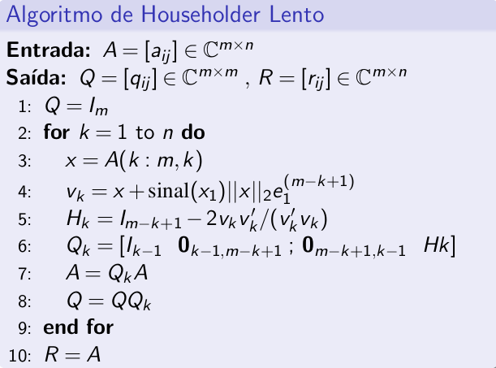

<div>

## Description

<p>
Any rectangular matrix A of type M x N can be decomposed into a product of an orthogonal matrix Q and an upper (right) triangular matrix R, as described in the QR decomposition, in other words it is a linear transformation that describes a reflection with respect to a plane or hyperplane that contains the origin.
</p>
  
## Install
  
``` 
npm i householder-matrix
``` 

## Usage
```typescript
import qr_decomposition from 'householder matrix';

const { Q, R } = qr_decomposition([
  [-1, -1, 1],
  [1, 3, 3],
  [-1, -1, 5],
]); 
``` 
  
## Pseudocode



## How to use

```bash
# Clone this repository
$ https://github.com/joaovitor32/householder-matrix

# Go into the repository
$ cd householder-matrix

# Install dependencies
$ npm install

# Run tests
$ npm run test

# Run server
$ npm run dev:server
```

<p>Based on https://github.com/rfabbri/aln-book lectures</p>

<p>References:</p>

- [Cornell](https://www.cs.cornell.edu/~bindel/class/cs6210-f12/notes/lec16.pdf)
- [Stack-overflow](https://stackoverflow.com/questions/509211/understanding-slice-notation)
- [Rosetta-code](https://rosettacode.org/wiki/QR_decomposition#Python)

</div>
